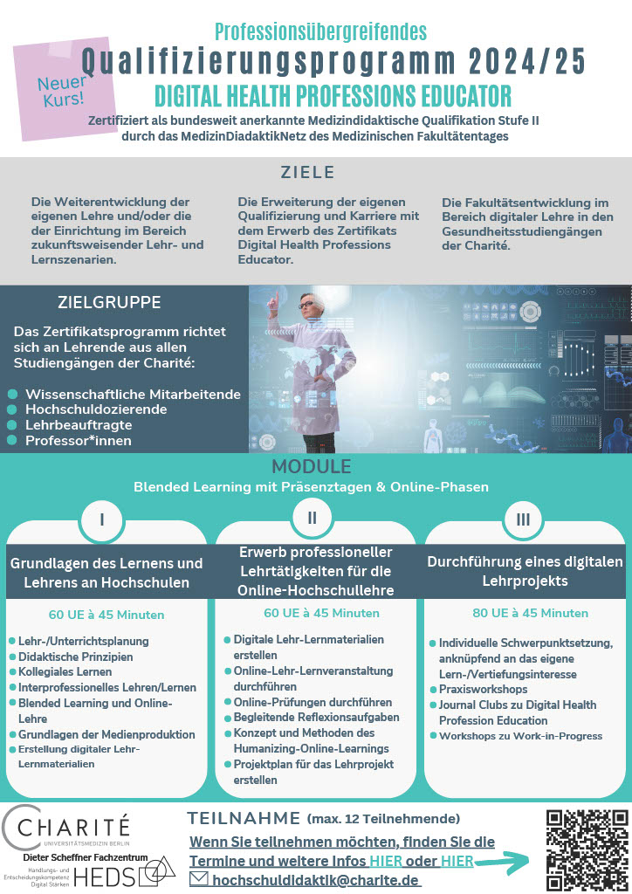
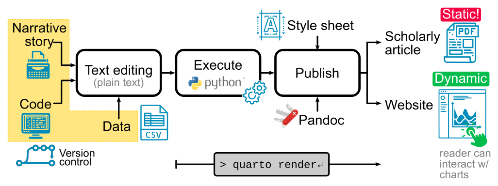
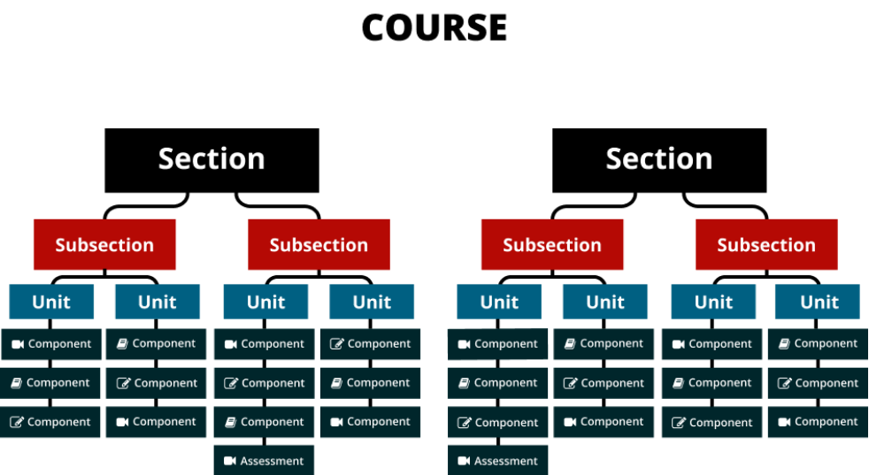

# Course Concept {#sec-course-concept}

## General idea
This open, practice-oriented course introduces the fundamentals of pharmacokinetic (PK) and pharmacodynamic (PD) modelling, with a strong emphasis on reproducible research, open science, and digital competencies in health professions education. Leveraging best practices from software development—such as version control via Git and GitHub, continuous integration (CI) for automated course building, and open formats like Markdown—the course is designed as a fully open educational resource. Hosted on the Open edX platform, it combines theoretical foundations with interactive, hands-on learning to equip participants with the skills needed to understand, simulate, and critically assess PK/PD models in clinical and research contexts.

The course consists of the following complementary parts which should allow as much offline studying as possible:

1. **Short lectures** about pharmacokinetics in the form of a book chapter providing the content. The book is available as HTML webpage, PDF, Epub and HTML slideshow. [Quarto](https://quarto.org) is used to render high quality books with professional figures, layouts, full text search, cross references, references, citation, and the possibiliy to compile to multiple output formats.
2. **Short presentations** for motivation and providing up to date use cases in the form of short videos and accompanying slides.
3. An **Open edX course** for the respective chapter with interactive content (quizzes, H5P components).
4. **Interactive Jupyter notebooks and simple apps** for active exploration of the course content. See for instance the [indocyanine green application](https://icg-model.streamlit.app/).

{#fig-dhpe width=50% fig-cap-location="bottom"}

The course was developed as part of the [Digital Health Professions Educator](https://lernzentrum.charite.de/projekte/heds/digital_health_professions_educator) 2024/2025. The course is the digital teaching project of phase III (see @fig-dhpe.)

## Technology {#sec-technology}
In this section we provide an overview of the technology behind the course. The following figure provides an overview of the workflow of the course.

Figure 1: Course writing workflow, starting from plain text (narrative, code and data) all under version control for reproducibility. 

### Markdown

Markdown is a lightweight markup language that allows you to write structured documents using plain text. It's widely used in data science, software development, and open education for writing documentation, course materials, and scientific reports. Markdown is easy to learn and supports formatting elements like headings, emphasis, lists, links, and code blocks without the overhead of complex formatting tools. In this course, you’ll use Markdown to document your models, write reports, and create reproducible workflows with tools like Quarto and Jupyter Notebooks.

**Recommended resources to get started:**

* [Markdown Guide (beginner-friendly)](https://www.markdownguide.org/)
* [GitHub Flavored Markdown cheatsheet](https://github.github.com/gfm/)
* [Quarto Markdown Reference](https://quarto.org/docs/authoring/markdown-basics.html)

### Version control

Version control is a system that tracks changes to files over time, enabling users to manage revisions, collaborate efficiently, and maintain a complete history of their work. It allows users to revert to previous versions, compare changes, and resolve conflicts when multiple contributors edit the same content. Version control is essential for collaborative projects, ensuring transparency, consistency, and reproducibility.

In this course, all teaching materials are managed using version control through a GitHub repository: <https://github.com/matthiaskoenig/dhpe-pkpd/>. The content is written in Quarto QMD markdown files, and all updates made locally are systematically synchronized and pushed to the repository. This setup ensures that any changes to the course materials are tracked, making it easy to review updates, maintain a clean history of edits, and collaborate across contributors. Version control offers significant advantages for creating teaching materials: it supports iterative improvement, minimizes the risk of losing work, and provides a reliable way to roll back to previous versions if needed—all of which enhance the quality and reproducibility of educational content.

### Continous integration (CI)

Continuous Integration (CI) is a development practice where changes to a project are automatically tested and integrated on a regular basis. CI helps identify issues early, ensures consistency across updates, and automates repetitive tasks such as building, testing, and deploying code. This leads to faster development cycles, higher quality output, and greater confidence in the stability of the project.

For this course, CI is implemented using [GitHub Actions](https://github.com/matthiaskoenig/dhpe-pkpd/actions) to automatically build and deploy the course content. Whenever changes are made to the repository, the content is rebuilt and published to the course webpage at <https://matthiaskoenig.github.io/pkpd>. This automated workflow ensures the site is always up to date with the latest teaching materials, improving reliability, reproducibility, and ease of maintenance.

### Quarto

- Notebook and markdown based publishing tools
- Quarto is an open-source scientific and technical publishing system available from <https://quarto.org/>.
- Publish reproducible, production quality articles, presentations, dashboards, websites, blogs, and books in HTML, PDF, MS Word, ePub, and more.
- For a nice introduction to the features see: <https://gael-close.github.io/posts/2209-tech-writing/2209-tech-writing.html>

#### Interactivity

- Quarto supports interactivity via different methods: <https://quarto.org/docs/interactive/>
- Create custom JavaScript visualizations using Observable JS: <https://quarto.org/docs/interactive/ojs/>
- Incorporate Jupyter Widgets: <https://ipywidgets.readthedocs.io/en/latest/>
- Shiny for Python integration: <https://quarto.org/docs/dashboards/interactivity/shiny-python/index.html>

### Jupyter notebooks
[Jupyter](https://jupyter.org/) Notebooks are interactive documents that combine code, text, and visual outputs, making them ideal for exploring and teaching computational topics in an engaging and reproducible way.

For this course, multiple sets of notebooks are generated to support different learning needs: content and teaching notebooks are rendered to the course webpage, while separate exercise notebooks offer hands-on practice, and solution notebooks provide detailed reference material.

#### Course structure

The course is structured in sections, subsections and units.

<!-- Create a figure with the actual content structure; use the meridian  -->

### Generative AI

Generative AI refers to a type of artificial intelligence designed to create new content, such as text, images, music, or code, by learning patterns from existing data. It uses models like neural networks to generate outputs that resemble human creativity and reasoning.

All course content is supported by [ChatGPT](https://chatgpt.com). Initial drafts are created, and materials are continuously updated and refined using generative AI.

### Video recording (OBS Studio)

[OBS Studio](https://obsproject.com/) (Open Broadcaster Software) is a free, open-source software for video recording and live streaming. It allows users to capture and mix video/audio in real time with customizable scenes, sources, and transitions. Popular among streamers, educators, and content creators, OBS supports platforms like YouTube, Twitch, and Zoom.

Videos in this course are recorded using OBS Studio and subsequently hosted on youtube.