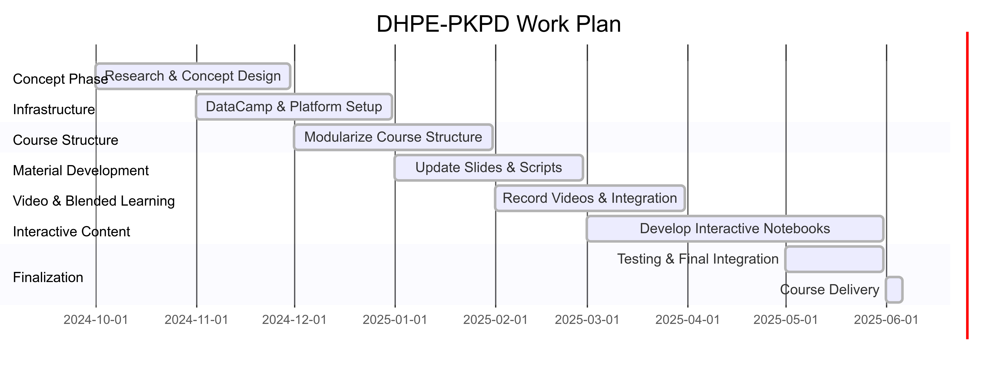

# Project Outline {#sec-project-outline}

## Project Title

DHPE-PKPD – Interactive and Open Course on Pharmacokinetic (PK) and Pharmacodynamic (PD) Modeling

## Acronym

DHPE-PKPD

## Initial Situation in Teaching and Learning at Your Institution

The four-day course on pharmacokinetics and pharmacodynamics at Humboldt-Universität zu Berlin is held annually during the first week of June as a mandatory component of Module MB19 (next date: June 3–6, 2025). It primarily targets bachelor students in biology and biophysics but is also attended by other participants (e.g., Humboldt Internship students). The course currently consists of lecture blocks and seminars in 1.5-hour units—with no practical or interactive elements.

Each year, approximately 15–20 students with minimal to moderate programming skills take part. Various thematic blocks are offered, with the pharmacokinetics and pharmacodynamics section under my responsibility for organization, content, moderation, and supervision. However, the current structure offers few opportunities for hands-on modeling, independent work, or digital teaching formats—this is the focus of the proposed project.

## Key Challenges and Problems Addressed

The DHPE project addresses core challenges in current teaching: lack of interactivity, limited methodological diversity, and insufficient digital support. The existing course is based on traditional lectures without blended learning elements or practical exercises. Digital media are used minimally, and project-based learning is largely absent. In addition, teaching materials are only partially available in open formats. The goal is to overcome these deficits by developing a modern, interactive course that combines project-based learning, digital tools, and open educational formats.

## Project Description, Measures, and Objectives

The project *DHPE-PKPD – An Interactive and Open Course for Pharmacokinetic (PK) and Pharmacodynamic (PD) Modeling* aims to fundamentally modernize the existing course and transform it into a future-oriented digital blended learning format. The objective is to create a modular course that combines modern didactic approaches, digital tools, and open educational resources, offering students a practice-oriented and engaging learning experience in PK/PD modeling.

### Digital and Interactive Media

Knowledge will be conveyed through interactive content that fosters independent learning and direct application. Browser-based web applications and Jupyter Notebooks will be used to explore concrete questions in pharmacokinetics and pharmacodynamics, with a focus on practical tasks such as modeling drug concentration-time curves, parameter analysis, and dose adjustments.

### Use of Open Technologies

All content will be created using open, reusable technologies such as Markdown, Quarto, GitHub, and HTML. This ensures transparency, reusability, and long-term maintainability. The course will be openly available online in English, benefiting external learners such as international students or educators.

### Integration of Modern Didactic Concepts

The course will be divided into smaller, more digestible learning units, each with a clear focus. Interactive elements such as live coding, quizzes, discussion formats, activation games (e.g., "Spektrum"), and warm-up activities will enhance engagement and learning retention. Informal formats outside the classroom will also be employed to encourage reflection and exchange.

### Blended Learning Concept

Core content will be provided through videos, explanatory texts, and interactive modules for self-paced study. In-person sessions will focus on discussion, collaborative problem-solving, and project support. By shifting cognitively less demanding phases to self-learning ("flipped classroom"), face-to-face time will be used more effectively.

### Foundational Programming Support via DataCamp

To support students with limited programming experience, the online platform DataCamp will be integrated into the course design. Through personalized learning paths, students will acquire basic Python and data analysis skills before engaging with modeling tasks.

### Project Objectives

- Increase interactivity and practical relevance through digital, open, and reusable materials.
- Promote project-based learning with real-world research and clinical scenarios.
- Lower the barrier to entry for modeling through programming training and guided interactivity.
- Ensure sustainable availability and openness of teaching materials to foster an open education and science culture.
- Encourage active, collaborative learning processes that go beyond traditional lecture formats.

In the long term, the project will serve as a model for other digital teaching formats in biomedical modeling and data science and have impact beyond the university. Its strong alignment with research and open science initiatives ensures high transferability to current scientific developments.

## Contribution of the Project to the Identified Challenges

The project systematically addresses existing shortcomings in teaching—particularly the lack of interactivity, methodological diversity, practical components, and openness of materials. By converting the current lecture-based format into an interactive, digital, and project-based course, a fundamental shift in how PK/PD content is taught will be initiated.

The new concept enables students to actively engage with real-world problems, develop modeling skills, and apply digital tools hands-on. Integrating Jupyter Notebooks, DataCamp, and open web applications makes the subject matter accessible even to students with little prior experience.

Simultaneously, the project promotes openness and sustainability: all materials will be created in open formats and published online. This ensures not only long-term use but also adaptability by other educators and learners.

The course will evolve from a passive, lecture-centered offering into a future-oriented, digital learning experience that promotes active learning, collaboration, and scientific reproducibility—thus making a lasting contribution to the advancement of university teaching in digital health education.

## Work Plan & Work Packages (WP)

**Project period:** October 2024 – June 2025  
**Course implementation:** Early June 2025

### WP1: Research & Concept Development (October – November 2024)

- Research digital teaching methods and existing PK/PD course formats  
- Analyze suitable technologies (Jupyter, Quarto, GitHub, DataCamp, etc.)  
- Design an integrated didactic and technical concept  
- **Milestone 1 (MS1): Concept phase completed**

### WP2: DataCamp Integration & Infrastructure Setup (November – December 2024)

- Select and organize suitable DataCamp courses  
- Set up course access for students  
- Prepare technical infrastructure (GitHub, hosting, Quarto)  
- **MS2: Platform operational with DataCamp integration**

### WP3: Course Structure & Thematic Units (December 2024 – January 2025)

- Restructure course into smaller, modular units  
- Develop didactic guidelines for interactive elements  
- **MS3: New course structure finalized (end of January)**

### WP4: Material Update – Slides & Scripts (January – February 2025)

- Update and redesign lecture slides  
- Revise supporting materials using Quarto Markdown  
- **MS4: Core materials completed**

### WP5: Video Production & Blended Learning Preparation (February – March 2025)

- Record introductory videos and micro-lectures  
- Integrate videos into the Quarto website and learning platform  
- **MS5: All videos produced and embedded**

### WP6: Development of Interactive Jupyter Notebooks (March – May 2025)

- Create interactive modeling examples using Jupyter  
- Integrate exercises and feedback features  
- **MS6: Interactive content finalized (end of May)**

### WP7: Testing & Final Integration (May 2025)

- Conduct functionality testing of all components  
- Pilot run and evaluation  
- **MS7: Course finalized**

