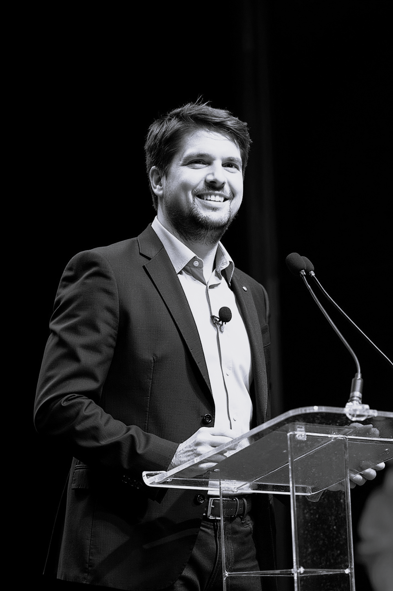

# About {.unnumbered}

## About the Instructor
Dr. Matthias König is a researcher and educator at Humboldt-Universität zu Berlin, where he leads the *Systems Medicine of the Liver* group. His work focuses on computational modeling, pharmacokinetics, and digital health education. He is passionate about making complex biomedical processes understandable and accessible through open, interactive learning resources.  

This course was developed as part of the DHPE program to promote modern, reproducible, and learner-centered education in PK/PD modeling.

{width=300}

**Dr. Matthias König**  
Humboldt-Universität zu Berlin  
Systems Medicine of the Liver  
[https://livermetabolism.com](https://livermetabolism.com)

